# Customer API Guide

This guide explains how to interact with the Altis Engine as a client (e.g., a travel agency or airline frontend).

## 🌍 Base URL

The API is available at: `http://localhost:8080` (Default)

---

## 🔑 Authentication

Most endpoints require a JSON Web Token (JWT).

### 1. Get a Guest Token
Start your session by obtaining a temporary token.
```bash
curl -X POST http://localhost:8080/v1/auth/guest \
  -H "Content-Type: application/json"
# Returns: {"token": "..."}
```

### 2. Using the Token
Include the token in the `Authorization` header for all protected requests:
`Authorization: Bearer <your_token>`

---

## �️ Booking Journey Map

The following map shows how UI steps interact with the Altis Engine API.

```mermaid
sequenceDiagram
    participant User as ✈️ Traveler
    participant UI as 📱 Airline Frontend
    participant API as ⚙️ Altis Engine

    Note over User, API: 1. SEARCH PHASE
    User->>UI: Searches for flights (SIN-KUL)
    UI->>API: POST /v1/offers/search
    API-->>UI: List of Offers (expires in 15m)

    Note over User, API: 2. SELECTION PHASE
    User->>UI: Selects specific flight/bundle
    UI->>UI: Stores offer_id in local state

    Note over User, API: 3. GUEST DETAILS PHASE
    User->>UI: Enters names, DOB, contact info
    UI->>API: POST /v1/offers/{id}/accept
    Note right of API: Converted to PROPOSED Order
    API-->>UI: order_id (Hold for 30m)

    Note over User, API: 4. EXTRAS PHASE
    User->>UI: Selects seats & meals
    UI->>API: POST /v1/orders/{id}/customize
    API-->>UI: Updated Order

    Note over User, API: 5. PAYMENT PHASE
    User->>UI: Enters payment details
    UI->>API: POST /v1/orders/{id}/pay
    API-->>UI: PAID Order + Barcodes
```



---

## �🛒 The Retailing Journey

### 1. Search for Offers
Search for flights and dynamic bundles.
```bash
curl -X POST http://localhost:8080/v1/offers/search \
  -H "Authorization: Bearer {token}" \
  -H "Content-Type: application/json" \
  -d '{
    "origin": "SIN",
    "destination": "KUL",
    "departure_date": "2024-06-01",
    "passengers": 1
  }'
```

### 2. Accept an Offer
Create a `PROPOSED` order by providing passenger and contact details.
```bash
curl -X POST http://localhost:8080/v1/offers/{offer_id}/accept \
  -H "Authorization: Bearer {token}" \
  -H "Content-Type: application/json" \
  -d '{
    "customer_email": "primary.contact@example.com",
    "contact_info": {
      "email": "primary.contact@example.com",
      "phone": "+65 9123 4567",
      "first_name": "John",
      "last_name": "Smit"
    },
    "travelers": [
      {
        "traveler_index": 0,
        "ptc": "ADT",
        "first_name": "John",
        "last_name": "Smith",
        "date_of_birth": "1985-05-20",
        "gender": "MALE"
      },
      {
        "traveler_index": 1,
        "ptc": "CHD",
        "first_name": "Sarah",
        "last_name": "Smith",
        "date_of_birth": "2015-08-12",
        "gender": "FEMALE"
      }
    ]
  }'
```
> [!NOTE]
> All personal information (Names, DOB, Phone) is automatically masked in system logs to ensure data privacy.

### 3. Customize Order (Optional)
Select specific seats or meals for the passengers.
```bash
curl -X POST http://localhost:8080/v1/orders/{order_id}/customize \
  -H "Authorization: Bearer {token}" \
  -H "Content-Type: application/json" \
  -d '{
    "seat_selections": [
      { "flight_id": "AL101", "passenger_index": 0, "seat_number": "12A" }
    ],
    "meal_selections": [
      { "flight_id": "AL101", "passenger_index": 0, "meal_code": "VGML" }
    ]
  }'
```

### 4. Add Extras / Reshop (Optional)
Add additional products (bags, insurance) to an existing order.
```bash
curl -X POST http://localhost:8080/v1/orders/{order_id}/reshop \
  -H "Authorization: Bearer {token}" \
  -H "Content-Type: application/json" \
  -d '{
    "add_products": ["{product_uuid}"]
  }'
```

### 5. Complete Payment
Finalize the order and generate fulfillment.
```bash
curl -X POST http://localhost:8080/v1/orders/{order_id}/pay \
  -H "Authorization: Bearer {token}" \
  -H "Content-Type: application/json" \
  -d '{
    "payment_token": "tok_mock_success",
    "payment_reference": "ref_123"
  }'
```
> [!IMPORTANT]
> **The Finish Line**: Successful payment transitions the order to the `PAID` state, which:
> 1. **Stops the Hold Timer**: The 30-minute expiration is cancelled.
> 2. **Commits Inventory**: The seat hold becomes a permanent booking.
> 3. **Generates Fulfillment**: Returns the final ticket barcodes/QR codes for the travelers.

### 4. Retrieve Order
View order status and fulfillment barcodes.
```bash
curl http://localhost:8080/v1/orders/{order_id} \
  -H "Authorization: Bearer {token}"
```

---

---

## ⏳ Expiration & Hold Times

The Altis Engine uses a two-stage hold system to balance inventory availability and user experience.

### 1. Transient Offer (15 Minutes)
- **Trigger**: Starts when you call `/v1/offers/search`.
- **Purpose**: Reserves a temporary "price quote" and flight availability.
- **Expiry**: If the user stays on the flight results page for >15 minutes without clicking "Next", the offer expires. The user must search again to get fresh prices.

### 2. Order Hold (30 Minutes)
- **Trigger**: Starts when you call `/v1/offers/{id}/accept` (typically at the Guest Details step).
- **Purpose**: Provides a formal inventory hold. The flight is effectively "pre-booked" for the user.
- **Expiry**: The user is granted **30 minutes** (configurable by airline) to complete customization (seats, meals, bags) and payment. 

| Phase | Duration | Status | transition |
|-------|----------|--------|------------|
| Search Results | 15 Mins | Transient | Call `accept_offer` to lock in |
| Order Creation | 30 Mins | PROPOSED | Call `pay_order` to finalize |

---

## 🎨 Frontend Integration Guide (UX)

To ensure a premium user experience and high conversion rates, the client application should proactively manage these expirations.

### 1. The Search Phase (Offers)
- **Visual Urgency**: On the flight results page, display a countdown or message: *"Prices guaranteed for 15 minutes"*.
- **Graceful Refresh**: If the 15-minute window expires, show a modal: *"Search results have expired to ensure you get the best current price. [Refresh Results]"*.
- **Error Handling**: Catch `410 Gone` on `accept_offer` and redirect the user back to search with a friendly explanation.

### 2. The Checkout Phase (Orders)
- **Sticky Timer**: Once guest details are entered and the order is created, show a persistent timer in the header: *"Your booking is held for 29:59"*.
- **Cart Reclamation**: If the user leaves the page and returns later (within the 30m window), use the `order_id` from local storage to call `GET /v1/orders/{id}` and resume their progress.
- **Expiration Enforcement**: Both `/v1/orders/{id}/pay` and `/v1/orders/{id}/payment-intent` will return **`410 Gone`** if called after the 30-minute window.
- **In-Flight Payment Protection (Lock-in)**: If a user calls `/pay` at the very last second (e.g., 29:59), the engine immediately transitions the order to **`PAYMENT_PENDING`**. This status "freezes" the inventory hold, ensuring the seat isn't released while the bank is still processing the transaction.
- **Expiry Modal**: If they time out at the payment stage, explain that the seat has been released to others and offer to restart the checkout.

---

## 🆘 Industry Standards Support

### NDC AirShopping (v21.3)
```bash
curl -X POST http://localhost:8080/v1/ndc/airshopping \
  -H "Content-Type: application/json" \
  -d '{ ... NDC XML-mapped JSON ... }'
```

### ONE Order Retrieve
```bash
curl -X POST http://localhost:8080/v1/oneorder/retrieve \
  -H "Content-Type: application/json" \
  -d '{"order_id": "..."}'
```
