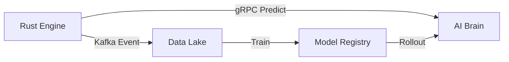

# Technical Architecture: Altis AI Brain

This document defines the technical specifications for the external AI/ML ranking service.

## 1. gRPC Interface Implementation
The service must implement the `RankingService` defined in `ranking.proto`.

```python
import grpc
from concurrent import futures
import ranking_pb2
import ranking_pb2_grpc

class RankingServicer(ranking_pb2_grpc.RankingServiceServicer):
    def PredictConversion(self, request, context):
        # 1. Extract context
        segment = request.search_context.user_segment
        features = request.offer_features
        
        # 2. Run Inference
        probability = model.predict(request)
        
        # 3. Return result
        return ranking_pb2.PredictConversionResponse(probability=probability)
```

## 2. Model Architecture: Wide & Deep (W&D)
To capture both "memorization" (known strong bundles) and "generalization" (new combinations), we propose a Wide & Deep structure:
- **Wide Part**: Memorizes cross-product features (e.g., `Premium Segment` + `Lounge Access`).
- **Deep Part**: Deep neural network for sparse features (e.g., `Departure Date`, `Search History`).

## 3. Real-time Telemetry Loop


## 4. Hardware Acceleration
- **CPU Inference**: Optimized via Intel OpenVINO or ONNX Runtime.
- **GPU Inference**: Optional for high-throughput peaks using NVIDIA CUDA.

## 5. Branching Strategy
A separate repository/branch `altis-brain-python` will be established to allow the Data Science team to iterate at their own pace.
