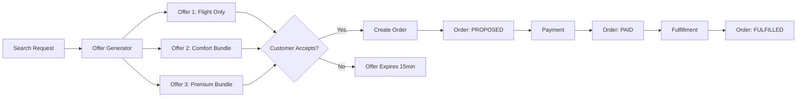
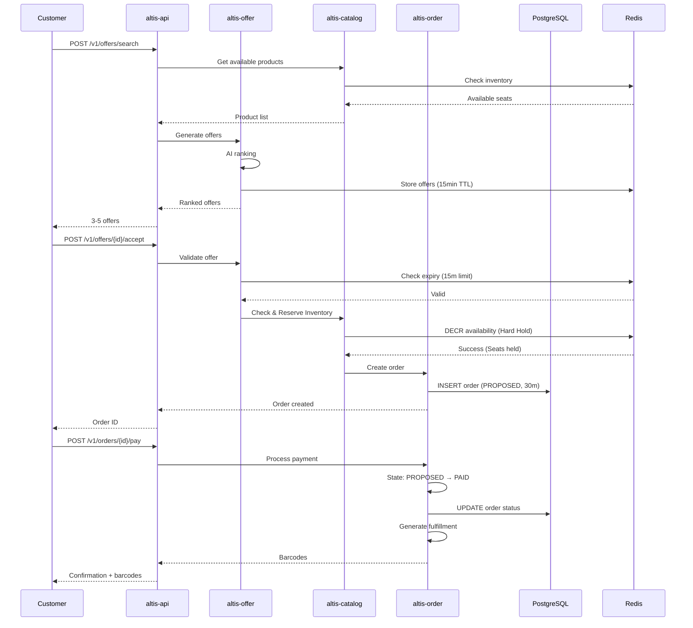
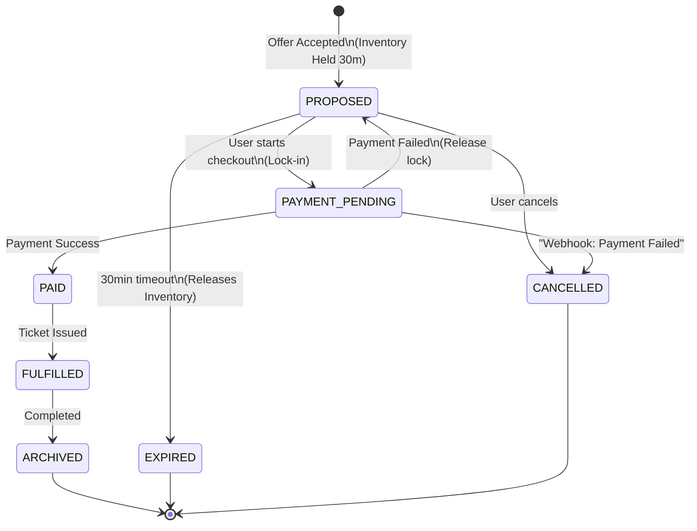
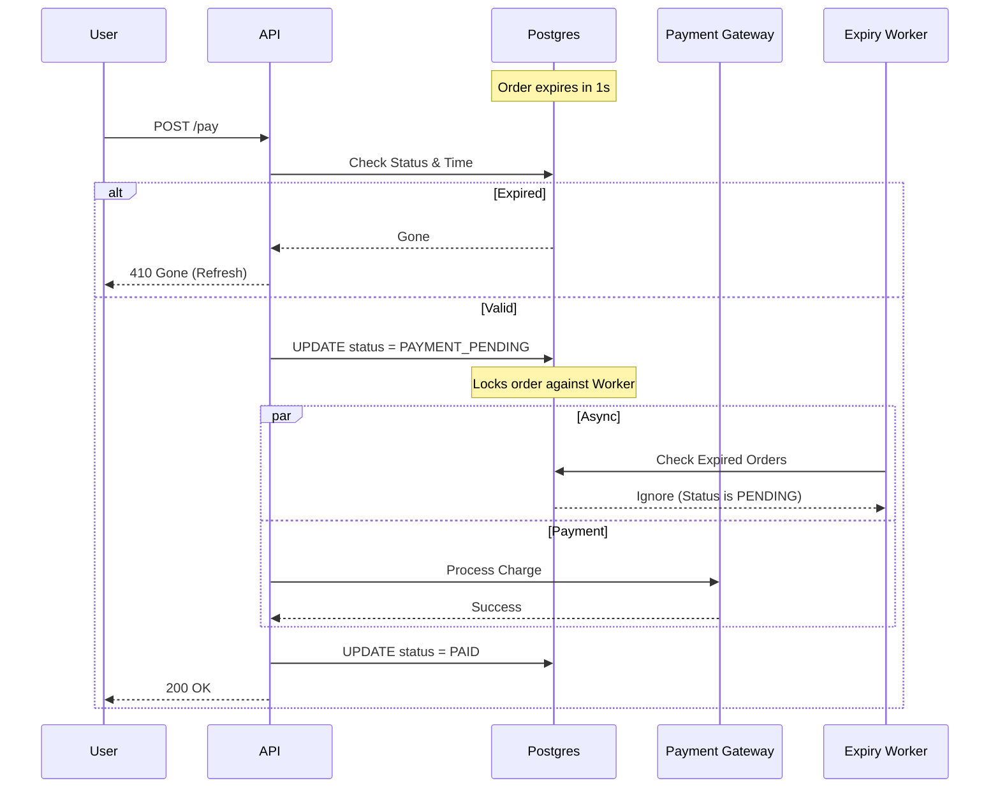
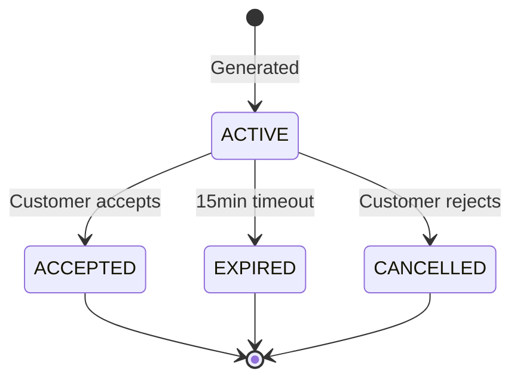

# Altis Engine - Architecture Overview

## System Architecture

Altis is built on a modern **Offer/Order** architecture that replaces legacy PNR/E-Ticket systems with a flexible, scalable approach to airline retailing.

---

## Core Concepts

### 1. Offer vs. Order



**Offer**: Temporary (15-min expiry), AI-generated bundle  
**Order**: Permanent record, single source of truth

### 2. Unified Product Model

```rust
pub enum ProductType {
    Flight,
    Seat,
    Bag,
    Meal,
    Lounge,
    CarbonOffset,
    Insurance,
    FastTrack,
}
```

All products share the same structure - enabling seamless bundling and pricing.

---

## Crate Architecture

### Hexagonal Design

```
┌─────────────────────────────────────────────┐
│           altis-api (HTTP Layer)            │
│         Axum Routes + Middleware            │
└──────────────────┬──────────────────────────┘
                   │
┌──────────────────▼──────────────────────────┐
│          Business Logic Layer               │
├─────────────────────────────────────────────┤
│  altis-catalog  │  altis-offer  │ altis-order │
│  (Products)     │  (Bundles)    │ (Lifecycle) │
└──────────────────┬──────────────────────────┘
                   │
┌──────────────────▼──────────────────────────┐
│         altis-store (Adapters)              │
│    Postgres │ Redis │ Kafka                 │
└─────────────────────────────────────────────┘
```

### Crate Responsibilities

| Crate | Purpose | Key Components |
|-------|---------|----------------|
| **altis-catalog** | Product models + pricing | `Product`, `PricingEngine`, `InventoryManager` |
| **altis-offer** | Offer generation | `OfferGenerator`, `AIRanker`, `ExpiryManager` |
| **altis-order** | Order lifecycle | `OrderManager`, `FulfillmentService`, `ChangeHandler` |
| **altis-core** | Domain logic | Business rules, validation |
| **altis-store** | Data access | Postgres, Redis, Kafka adapters |
| **altis-shared** | Common types | Events, errors, utilities |
| **altis-api** | HTTP interface | REST endpoints, auth, middleware |

---

## Data Flow

### Search to Order Flow



---

## State Machines

### Order Lifecycle



### Payment Race Condition Protection

To prevent inventory from being released while a user is actively paying (e.g., at minute 29:59 of a 30-minute hold), Altis implements a **"Lock-in"** mechanism:




### Offer Lifecycle



---

## Continuous Pricing

### Algorithm

```rust
fn calculate_demand_multiplier(available: i32, capacity: i32) -> f64 {
    let utilization = 1.0 - (available as f64 / capacity as f64);
    
    // Exponential curve: price increases as seats sell
    let multiplier = 1.0 + (utilization * utilization * 2.0);
    
    // Clamp to reasonable limits
    multiplier.max(0.5).min(3.0)
}
```

### Example

| Seats Available | Utilization | Multiplier | Price |
|----------------|-------------|------------|-------|
| 100/100 | 0% | 1.0x | $200 |
| 50/100 | 50% | 1.5x | $300 |
| 10/100 | 90% | 2.62x | $524 |
| 1/100 | 99% | 2.96x | $592 |

**Advantage**: Smooth price curve vs. discrete bucket jumps.

---

## Scalability

### Read Path (Search)

```
Customer → API → Redis (Availability Index) → Response
```

- **Latency**: <10ms (p95)
- **Throughput**: >10,000 req/s per instance
- **Caching**: Flight availability cached in Redis

### Write Path (Booking)

```
Customer → API → Postgres (ACID) → Kafka (Events) → Analytics
```

- **Latency**: <100ms (p95)
- **Throughput**: >1,000 orders/s per instance
- **Consistency**: ACID transactions for order integrity

### Horizontal Scaling

- **Stateless API**: Scale API instances independently
- **Database**: Postgres read replicas for analytics
- **Cache**: Redis cluster for high availability
- **Events**: Kafka partitions for parallel processing

---

## Security

### Authentication

- JWT tokens for API access
- Guest tokens for anonymous browsing
- User tokens for order management

### Authorization

- Order ownership validation
- Rate limiting per customer
- IP-based throttling

### Data Protection

- Encrypted connections (TLS)
- PII encryption at rest
- PCI compliance for payment data

---

## Monitoring

### Key Metrics

- **Offer generation latency**: <200ms (p95)
- **Order creation latency**: <100ms (p95)
- **Pricing calculation**: <50ms
- **Offer acceptance rate**: >40%
- **Order modification rate**: Track refunds/changes

### Observability

- **Tracing**: Distributed tracing with OpenTelemetry
- **Logging**: Structured logs (JSON)
- **Metrics**: Prometheus + Grafana
- **Alerts**: Critical path failures, latency spikes

---

## Deployment

### Docker Compose (Development)

```yaml
services:
  api:
    build: .
    ports:
      - "8080:8080"
  postgres:
    image: postgres:15
  redis:
    image: redis:7
  kafka:
    image: confluentinc/cp-kafka:7.5.0
```

### Production (Kubernetes)

- **API**: Deployment with HPA (auto-scaling)
- **Database**: Managed Postgres (RDS, Cloud SQL)
- **Cache**: Managed Redis (ElastiCache, Memorystore)
- **Events**: Managed Kafka (MSK, Confluent Cloud)

