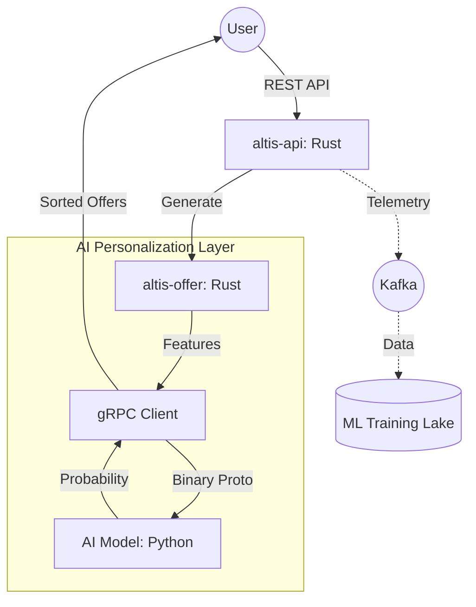

# AI Integration Architecture: gRPC & Protocol Buffers

This document explains the technical design for integrating AI-driven features into the Altis Engine, specifically for the Personalized Offer Ranking system.

## 1. Overview
The Altis Engine uses a **Polyglot Microservice** approach. While the core engine is built in **Rust** for performance and safety, the AI/ML models are typically served in **Python** or **Go**. To connect these worlds efficiently, we use **gRPC** and **Protocol Buffers (Proto)**.

## 2. Terminology

### Protocol Buffers (Proto)
*   **The "Contract"**: Defined in `proto/ranking.proto`.
*   **Binary Format**: Unlike JSON (text), Proto is serialized into a compact binary format. This reduces payload size by up to 80% and eliminates text parsing overhead.
*   **Code Generation**: Rust uses `tonic-build` to generate native structs from the `.proto` file. This ensures that the Rust backend and the AI service always agree on the data format.

### gRPC
*   **The "Telephone"**: A high-performance RPC framework.
*   **HTTP/2**: Uses HTTP/2 for features like multiplexing (multiple calls over one connection) and header compression.
*   **Bidirectional Streaming**: Supports real-time data flows if needed in the future.

## 3. High-Level Architecture

## 4. Why This Solution?

1.  **Interoperability**: Seamlessly connect Rust backends with Python data science stacks.
2.  **Performance**: Sub-millisecond latency for real-time offer ranking.
3.  **Type Safety**: The Rust compiler prevents sending invalid data to the AI service.
4.  **Separation of Concerns**: The AI team can update the model independently of the Rust engineering team as long as the Proto contract is maintained.

## 5. Event Telemetry for AI
To "teach" the AI, we collect three primary signals via Kafka:
1.  **OfferGenerated**: What we showed the user and what features were extracted.
2.  **OfferAccepted**: Which offer the user clicked or chose.
3.  **OrderPaid**: The final conversion (the "Label" for supervised learning).
