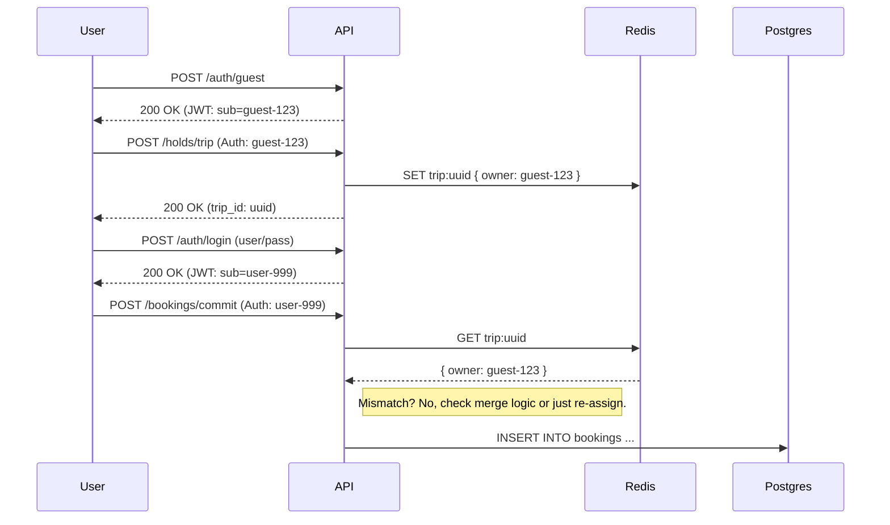

# Architecture Design: Session & Identity Management

## The Challenge
Airline booking engines must support **Anonymous (Guest) Users** who may or may not log in later.
- Users start searching/holding flights as a "Guest".
- They might log in *during* the flow (to use miles, saved cards).
- The "Hold" (Redis) relies on an identity to prevent other users from stealing it, but that identity might change (Guest -> User).

## Proposed Solution: "Anonymous-First" Identity

We treat *every* interaction as an authenticated interaction, where the distinction is just the "Level of Assurance".

### 1. The Session Token (JWT)
We introduce a **Session Token** (JWT) that is required for all state-changing APIs (`/holds`, `/bookings`).

#### A. Guest Access (Lazy Registration)
1. User lands on homepage.
2. Frontend calls `POST /v1/auth/guest` (or checks for existing local token).
3. Backend returns a JWT:
   ```json
   {
     "sub": "guest-uuid-1234",
     "role": "guest",
     "exp": 1710000000
   }
   ```
4. Frontend attaches `Authorization: Bearer <token>` to all subsequent requests.

#### B. Authenticated Access
1. User logs in via `POST /v1/auth/login`.
2. Backend validates credentials.
3. **Crucial Step (Session Merge)**: The backend issues a NEW JWT:
   ```json
   {
     "sub": "user-uuid-5678",
     "role": "authenticated",
     "previous_guest_id": "guest-uuid-1234" // Audit trail
   }
   ```
4. Only if necessary (e.g., if we stored the user_id in the *key* of Redis), we migrate data. However, our Holds design stores context *inside* the value, so we just update the Booking record at commit time.

### 2. Linking Holds to Sessions
Currently, `POST /v1/holds/trip` takes a `user_id` in the body.
**Refactoring**: It should extract `user_id` from the **JWT Principal**.

*   **Redis Key**: `trip:{trip_id}`
*   **Redis Value**:
    ```json
    {
      "flight_id": "...",
      "session_id": "guest-uuid-1234" (The `sub` from the JWT)
    }
    ```

### 3. The Commit Phase (Conversion)
When calling `POST /v1/bookings/commit`:
1. The endpoint inspects the *current* JWT (which might be the guest one OR a newly logged-in user one).
2. If the JWT `sub` does NOT match the `session_id` in Redis:
   - **Scenario A (Hacking)**: Reject.
   - **Scenario B (Login)**: Allow IF the "previous_guest_id" claim matches the Redis `session_id`.
   - **Scenario C (Simple)**: Just update the Redis Hold to point to the new User ID upon Login.

### 4. Recommendation for Altis
For the MVP/Phase 6, we should:
1. Implement a simple `GuestSession` logic.
2. Require the `Authorization` header for Holds.
3. Remove `user_id` from the request body (it shouldn't be client-controlled).

## Diagram

